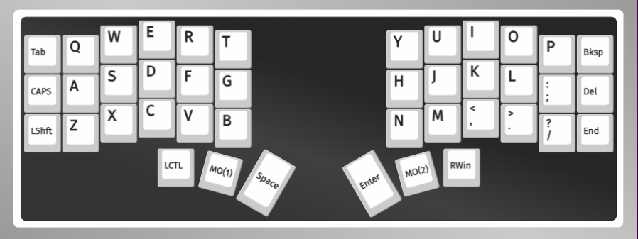
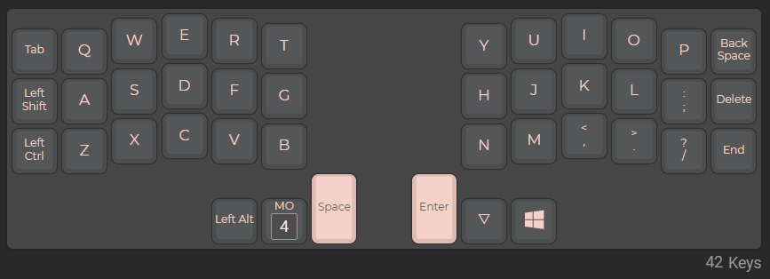
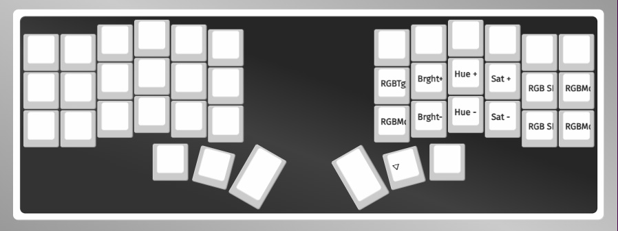

# A precompiled hex and source of my crkbd config for RGB Matrix

When adjusting and and compiling this again, please comment out all the code in `crkbd.c`... maybe im just a dummy, but I dont really know how to exclude the file.

**Features**
- VIA support
- RGB Matrix (Cannot be configured in VIA rn)
- Custom Slave OLED Splash
- Current Layer, Caps, and WPM Stats on Master

**RGB Effects** (*in order*)
- Breathing
- Band
- RGB Cycle (Static, Horizontal, and Vertical)
- Reactive Heatmap
- Typing Heatmap

**How to flash**
- Download [QMK Toolbox](https://github.com/qmk/qmk_toolbox/releases) for your system
- Click on `Open` and select the `crkbd-custom.hex` you downloaded from my repo
- Tick `Auto-Flash`
- Connect your CRKBD and press the reset switch
- Done

**Things I disabled for memory**
- Console
- Command
- Mousekey
- Space Cadet
- Grave Esc
- Magic
- Music
- RGB Light

## Layout
**Base** *Layer 0*

**Number and Nav** *Layer 1*

**Function** *Layer 2*

**Extra** *Layer 3*

## OLED Splash
