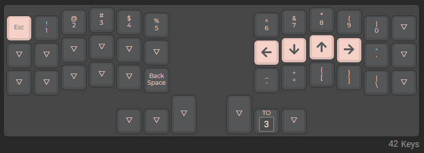
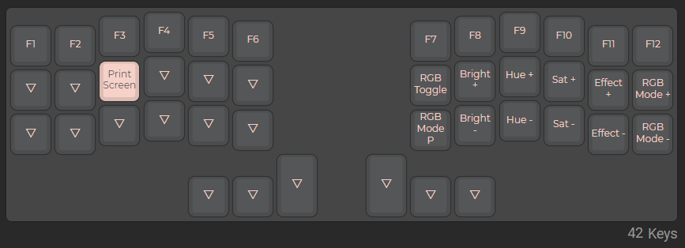

# RanCRKBD (A Precompiled QMK config)

I've made this hex config as a way for people to easily get into these types of keyboards since I myself came from an 80% myself. If you want a precompiled file, just download the 

**Features**
- RGB Matrix
- Custom Slave OLED Splash
- Current Layer, Caps, and WPM Stats on Master
- Specific Layer for FPS gaming and special Master OLED 

**RGB Effects** (*in order*)
- Breathing
- Band
- RGB Cycle (Static, Horizontal, and Vertical)
- Reactive Heatmap
- Typing Heatmap

**How to flash**
- Download [QMK Toolbox](https://github.com/qmk/qmk_toolbox/releases) for your system
- Click on `Open` and select the `crkbd-custom.hex` you downloaded from my repo
- Tick `Auto-Flash`
- Connect your CRKBD and press the reset switch
- Repeat for other side
- Done!

**How to compile**
- Make sure you have [QMK MSYS](https://msys.qmk.fm/)
- Move the `ransauce` directory inside `crkbd/rev1/keymaps`
- Open `QMK MSYS` and run `qmk compile -kb crkbd/rev1 -km ransauce`
- Follow `How to flash` to flash the firmware to your crkbd!

**Things I disabled for memory**
- Console
- Command
- Mousekey
- Space Cadet
- Magic
- Music
- RGB Light

## Layout
**QWERTY** *Layer 0* 
 
**NUMBER** *Layer 1* 
 
*note: esc has 3 functions, if pressed with Windows/Mac Key it acts as back-tick, if with shift a squigly* 
**FUNCTION** *Layer 2* 
 
**FPS** *Layer 3* 
 
**FPS EXTRA** *Layer 4* 

## Photos

